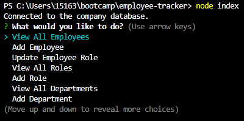

# Employee Tracker

## Description

Using `inquirer` and `mysql`, I was able to create a Node.js command line application to allow user interaction with a company database by viewing data, providing new data, and updating existing data. 

This was a challenge in learning how to use inquirer to leverage mysql and vice versa. For example, setting up functions to use inquirer responses to manipulate data via mysql, or leveraging data obtained via mysql to populate inquirer choices.

## Installation

Clone the repo, then from the command line, run npm install in the project's root directory to download any dependencies.

## Usage

The demo video can be found [here](https://youtu.be/_8QJR3SQ47k).

Navigate to project root directory and run the command `node index` to invoke the application. The application gives the user options to view different details within the database about the company, add new data, or change existing information. 

Below are the options initially provided upon initial launch of the application. The Quit option is not seen - 'Quit' allows the user to exit the application.

Shown below is an example of the results when the user selects 'View All Roles'.

## License

Please see repo for license information.